<div align="center">

# Pathfinder 🧭

[](https://github.com/codespaces/new/jucr-io/pathfinder?skip_quickstart=true&machine=standardLinux32gb&repo=514263361&ref=main&devcontainer_path=.devcontainer%2Fdevcontainer.json&location=WestEurope)

Kubernetes-native relay between an async message broker like Apache Kafka and the [Apollo Router](https://github.com/apollographql/router). It includes adapters for Kafka, Redis, Apollo and also multiple SerDes like JSON, Protobuf or even Protobuf with the wire format.

[Intro](#intro) •
[Usage](#usage) •
[Configuration](#configuration) •
[Architecture](#architecture) •
[Integrations](#integrations) •

</div>

# Intro

When implementing GraphQL subscriptions for a federated Graph, there are some interesting challenges to tackle:

1. Managing possible subscriptions on each Subgraph
2. Ingesting the updates - subscribers need to be notified whenever something has changed
3. Keeping a huge set of persistent connections open at the same time

To accomplish those challenges, Pathfinder was invented. It spins up a layer between an asynchronous message broker like Apache Kafka and the Apollo Router.
It has two main responsibilities:

- Listen for incoming subscriptions to store them in a KV store
- Listen for messages on a topic, deserialize/process them and publish updates to the router

🎉 This enables the deployment of real-time capabilities to any platform without the need to write any additonal
code while being fully customizable and deployable as a dedicated micro service for each domain you want to enable subscriptions in.

### A Naive Implementation

Normally, implementing those subscriptions in a federated GraphQL environment would result in the following architecture:

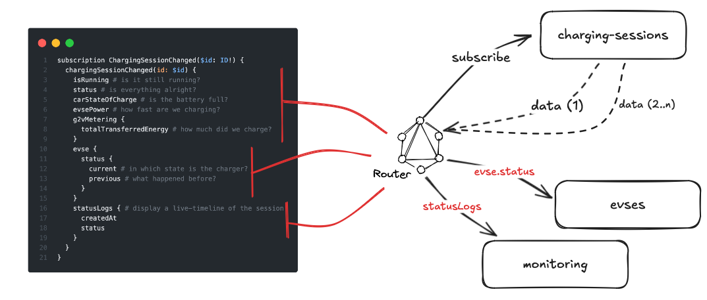

When analysing this in detail, we can see how requests are being made:

1. A client sends a request to the router with a subscription included + a selection of fields the client wants to fetch.
2. The Router now slices this overall request into multiple parts after determining which part of the data should be fetched from each Subgraph.
3. Our example subscription will be sent to and processed by `charging-sessions` while the additional data is fetched from `evses` and `monitoring`.
4. `charging-sessions` is responsible for initializing the connection/confirmation for the Router as well as for storing the subscription somewhere. It also needs to check for open subscriptions every time it receives an update on a charging session.

This does not scale well in a bigger organization:

- Different teams have different approaches to e.g. storage
- The same event listeners are built in multiple parts of the platform
- There will be multiple services taking care of subscriptions with their own logic on how to handle those, even though the principles are the same in all of them

### Pathfinder Implementation

To abstract and standardize the handling of subscriptions in a distributed platform, Pathfinder comes into play. It's built in a way that it can be deployed either per-subscription or also for multiple possible subscription types in parallel.

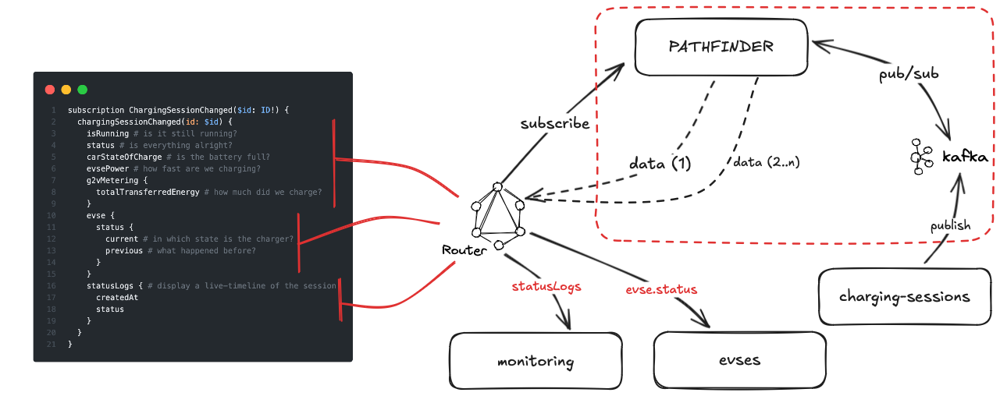

The new additional layer can now receive and manage all incoming subscriptions and publish updates with a proper payload extracted out of the incoming event payload. Downstream services can publish updates via the message broker and Pathfinder listens to those, so there is no real update needed on any of the services.
Depending on the configuration, it internally spins up a variety of handlers to support maximum concurrency while preserving ordering guarantees from a message broker. It will parallelize up to a single topic, on each topic the messages are processed sequentially.

# Usage

> [!TIP]
> We are right now building a Helm chart to make it possible to deploy natively with e.g. ArgoCD.

```txt
Usage: pathfinder [OPTIONS] <COMMAND>

Commands:
  listen
  export-schema
  publish-schema
  help            Print this message or the help of the given subcommand(s)

Options:
  -c, --config-path <CONFIG_PATH>  [env: CONFIG_PATH=]
  -h, --help                       Print help
  -V, --version                    Print version
```

# Configuration

The configuration for the Pathfinder service allows you to set up and customize various components like tracing, health checks, routing, message consumption, and more. Below is a breakdown of the key configuration options.

> [!TIP]
> A full example of a configuration file for Pathfinder can be found in `example-config.yaml`.

The configuration can either be done with yaml, via environment variables or also via a mix of both. The environment variable matching a yaml property is always ALL_UPPER, with a double `__` as seperator.

For example, the property `tracing.log_level` becomes `TRACING__LOG_LEVEL`.

### Basic Service Information

```yaml
service_name: "your-subgraph-name" # Name of your subgraph
link_version: "1.0"
federation_version: "2.7"
```

- `link_version`: Version of Apollo Link.
- `federation_version`: Version of Apollo Federation to use for generating schemas.

### Tracing

```yaml
tracing:
  log_level: "debug" # allowed: trace | debug | info | warn | error
  log_format: "fmt" # supported: json | fmt
```

### Health Endpoint

```yaml
health_endpoint:
  hostname: 0.0.0.0
  port: 8088
  path: "/health
```

### Router Endpoint

```yaml
router_endpoint:
  hostname: 0.0.0.0
  port: 8005
  path: "/graphql"
  subscription:
    inject_peer: "router.router" # optional
```

- `subscription.inject_peer`: If set, Pathfinder will extract the client IP of the incoming subscription request from the Router. So if the router sends a request with a callback URL like `https://router.router:8001/callback`, it will rewrite it to e.g. `https://10.0.16.24:8001/callback` to store the internal IP of the exact instance which sent the request. This concept is usually known as "sticky sessions".

### Router Client

```yaml
router_client:
  adapter: "http" # supported: http | in_memory
  http:
    timeout_ms: 1000
```

- `router_client.adapter`: The `in_memory` adapter is provided for easier local testing, it will log the outgoing requests and always succeed, except when the callback URL ends with `/error`.

### Message Consumer

```yaml
message_consumer:
  adapter: "kafka" # supported: kafka
  kafka:
    brokers: "localhost:9092"
    security_protocol: "plaintext" # supported: plaintext | ssl | sasl_plaintext | sasl_ssl
    sasl_mechanism: "plain" # supported: plain | scram-sha-256 | scram-sha-512
    sasl_username: "abc" # optional
    sasl_password: "abc" # optional
    session_timeout_ms: 10000
    heartbeat_interval_ms: 500
```

### KV Store

```yaml
kv_store:
  adapter: "redis" # supported: redis | in_memory
  redis:
    host: "127.0.0.1"
    port: 6379
    tls_enabled: true # optional
    db: 0 # optional, default=0
    username: "abc" # optional
    password: "abc" # optional
```

### GraphOS Client

This configuration is only required if you want Pathfinder to publish the auto-generated schema to GraphOS.

```yaml
graphos_client:
  adapter: "apollo" # supported: apollo
  apollo:
    advertised_subgraph_url: "http://test.com:3001/graphql"
    endpoint: "https://api.apollographql.com/api/graphql"
    graph_variant: "current"
    key: "abc"
    graph_ref: "abc"
```

- `graphos_client.apollo.advertised_subgraph_url`: The URL under which your Pathfinder instance(s) are reachable for the Router.

### Listeners

For each to-be-supported subscription operation, there are basic things to configure:

```yaml
listeners:
  - operation: "chargingSessionChanged"
    entity_name: "ChargingSession"
    description: "Notify when a charging session has changed, here with custom description." # optional
    id_key: "id"
    ttl_ms: 600000 # optional
    publish_initial_update: true # optional
    topics:
      - name: "charging_session_started"
        delay_ms: 5000 # optional
        data_serde: "json" # optional, default=json, allowed: json | protobuf | protobuf_wire
        data_source: "value" # optional, default=key, allowed: key | value
        strict_mapping: false # only for json -- default=false
        protobuf_mapping: # only for protobuf, protobuf_wire -- default=id/1
          id: 1
        json_mapping: # only for json
          id: "accountId" # optional, default key=property
      - name: "charging_session_updated"
      - name: "charging_session_terminated"
        terminates_subscriptions: true # optional, default=false
```

- `listeners.*.operation`: The name of the subscription operation. This will also be the name of the operation in the resulting auto-generated GraphQL schema.
- `listeners.*.entity_name`: Name of the entity of which Pathfinder should publish updates.
- `listeners.*.id_key`: The key under which the entity can be resolved by another Subgraph.
- `listeners.*.ttl_ms`: Maximum TTL of a single subscription. When its over, no new updates will be published.
- `listeners.*.publish_initial_update`: When enabled, Pathfinder will publish an initial update to the router when a new subscription is created. Important: this only includes an object with the id_key set to the id of the entity. The rest needs to be resolved by the router.
- `listeners.*.topics.*.delay_ms`: If set, Pathfinder will wait the specified amount of time (non-blocking!) until it publishes an update after it received something from the message consumer.
- `listeners.*.topics.*.terminates_subscriptions`: If enabled, Pathfinder will terminate all subscriptions for a certain entity when a message on such a topic is received. Before terminating and sending the `complete` message to the router, it will publish one last update to the router based on the incoming message.
- `listeners.*.topics.*.data_serde`: SerDe to use for deserializing an incoming message on a topic.
- `listeners.*.topics.*.strict_mapping`: Only for `data_serde=json`. If enabled, Pathfinder will strip all excess properties from the incoming messasge before sending it to the Router. Important: If this option is enabled, you also need to specify a `json_mapping`.
- `listeners.*.topics.*.json_mapping`: Only for `data_serde=json`. If specified, Pathfinder will rewrite the keys based on the configuration.
- `listeners.*.topics.*.protobuf_mapping`: Required for `data_serde=protobuf/protobuf_wire`. Tells Pathfinder which Protobuf tag to choose for each key.

# Architecture

_more details soon_

### General Flow

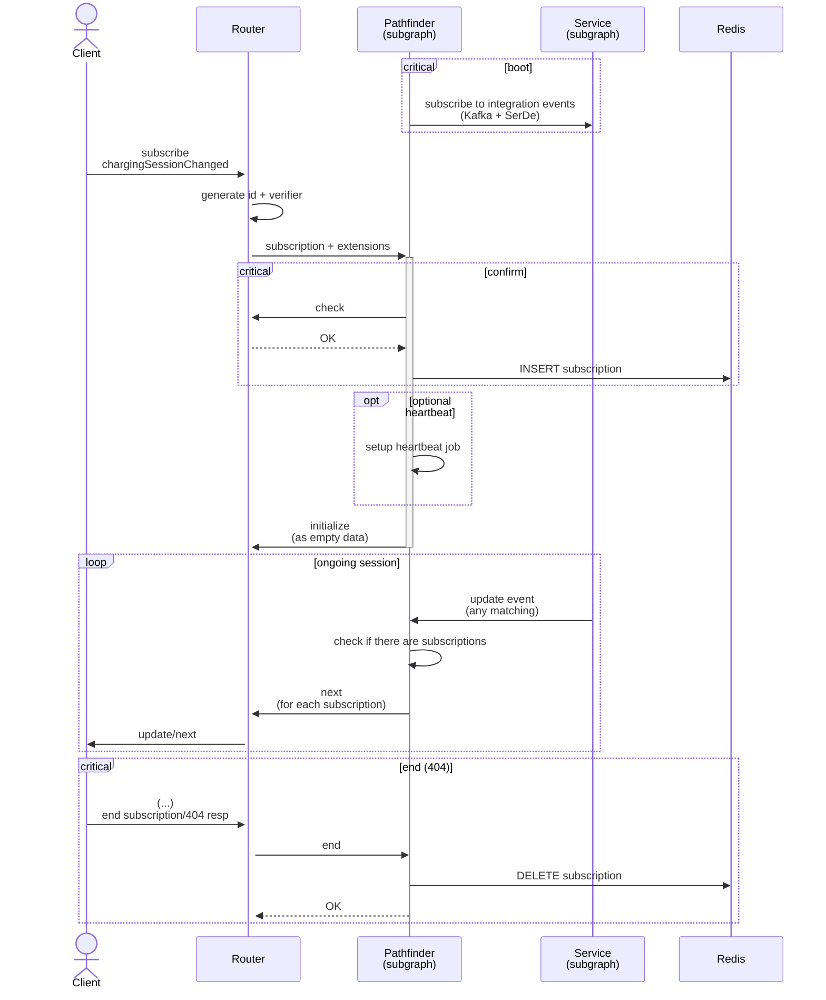

### Incoming Subscription Evaluation

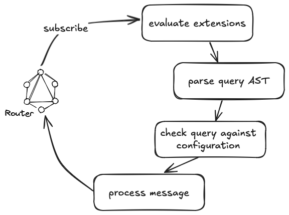

### Initialization Phase

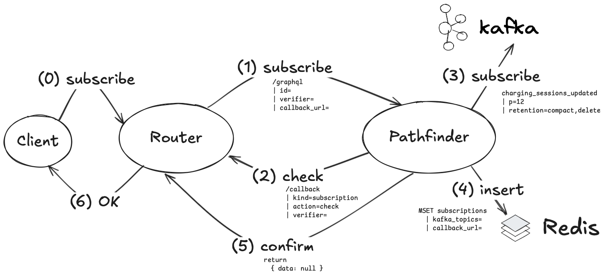

### Main Loop

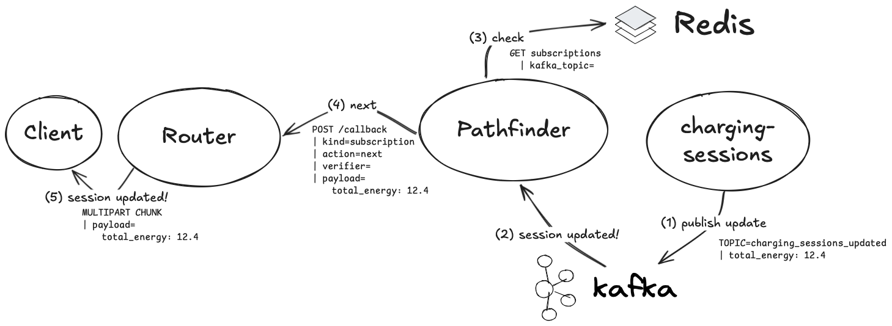

### Complete/End


# Integrations

This document outlines best practices for effectively leveraging Pathfinder in event-driven architectures platforms utilizing Domain-Driven Design (DDD) or traditional platforms that wants to use this powerful tool to enrich user real-time experience. Each section includes a brief description and a sequence diagram to illustrate key concepts.

## Enhancing Real-Time Capabilities on any platform

### Out of the box usage

Pathfinder can enrich platforms by adding real-time capabilities, adapting to different application architectures, whether fully event-driven or traditional.

### Diagram

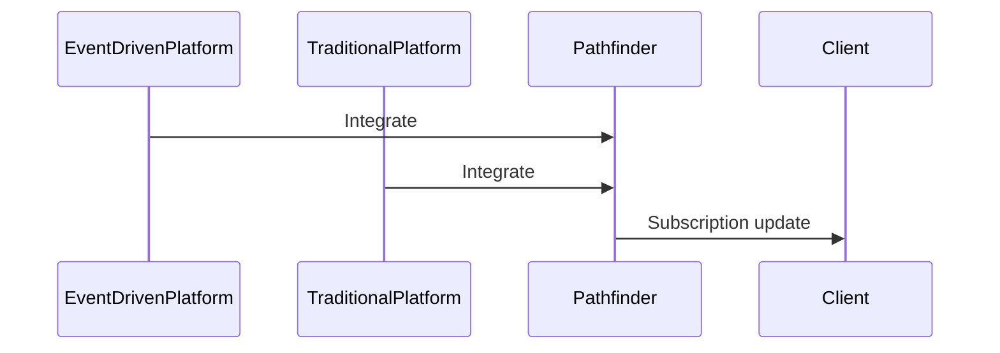

## Integrating with Event-Driven Architecture

### Overview

Utilize Pathfinder within event-driven architectures to enhance scalability and responsiveness. Integrating with Kafka allows for real-time data propagation, enabling services to react promptly to changes.

### Diagram

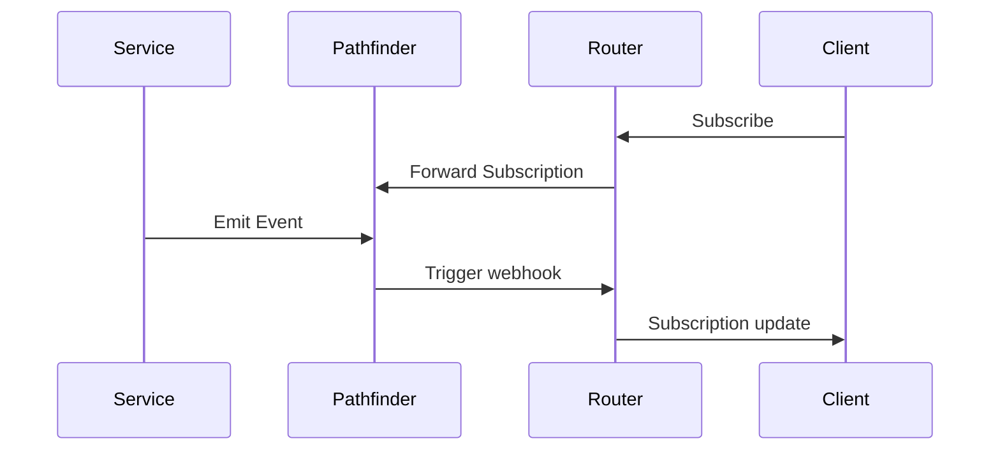

### Event Driven flow diagram

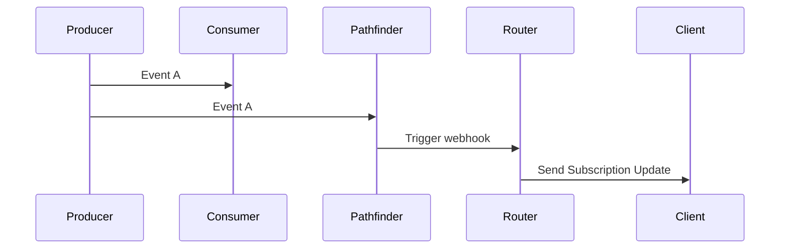

## Integrating with Domain-Driven Design (DDD)

### Application of DDD Principles

Pathfinder can efficiently manage domain events and notifications, aligning with DDD principles to maintain clarity in your domain model.

### Diagram

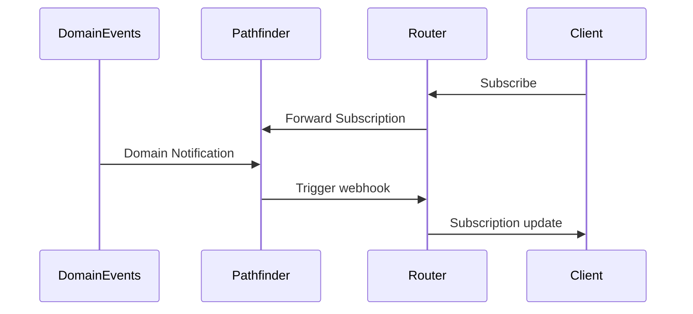

### DDD flow diagram

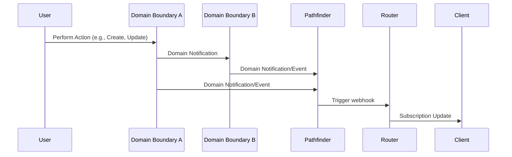

## Creating Custom Topics for Simplified Integration

### Custom Topic Creation

Encourage creating custom topics to send IDs whenever a change occurs, simplifying integration for platforms that may not fully utilize Kafka or DDD.

### Sequence Diagram

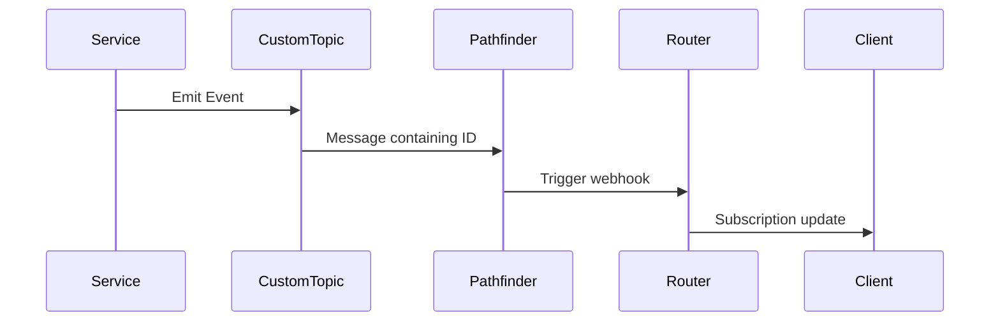
